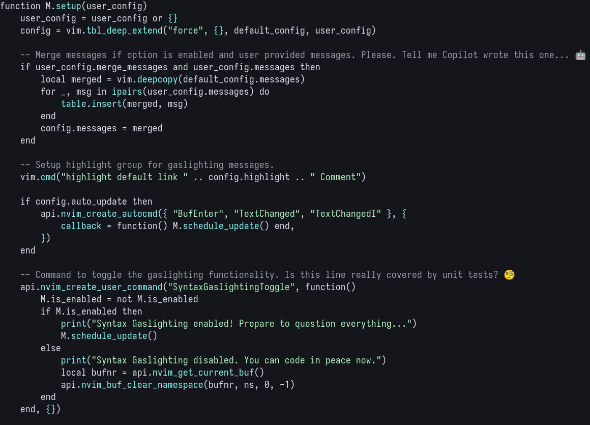

# syntax-gaslighting.nvim

<div align="center">
  <p>Gaslighting? That's not even a real word, you're crazy.</p>
  
</div>

## Usage

_Use what?_

Install with your favorite package manager (or Nix), then call the `setup`
function.

```lua
require("syntax-gaslighting").setup()
```

## Example Configuration

```lua
require("syntax-gaslighting").setup({
  -- Set the chance of gaslighting per line (1-100%)
  gaslighting_chance = 5,  -- Default is 5%

  -- Minimum line length to apply gaslighting
  min_line_length = 10,    -- Default is 10 characters

  -- Custom messages for gaslighting (optional)
  messages = {
    "Are you sure this will pass the code quality checks? 🤔",
    "Is this line really covered by unit tests? 🧐",
    -- Add more custom messages here...
  },

  -- Option to merge user messages with the default ones (default: false)
  -- If disabled, the messages table will override default messages.
  merge_messages = true,    -- Default is false

  -- Highlight group for gaslighting messages (linked to Comment by default)
  highlight = "GaslightingUnderline",

  -- Debounce delay for updates in milliseconds (default: 500ms)
  debounce_delay = 500,

  -- Auto-update on buffer events (default: true)
  auto_update = true,

  -- List of filetypes to ignore (default: {"netrw"})
  filetypes_to_ignore = { "netrw", "markdown" },  -- Add filetypes to ignore here
})
```

## License

[VSCode extension]: https://github.com/eNiiju/syntax-gaslighting
[@eNiiju]: https://github.com/eNiiju

Based on the awesome [VSCode extension] by [@eNiiju]. To remain compatible with
the license, syntax-gaslighting.nvim is licensed under the [MPL 2.0](./LICENSE).
Please see the license file for more details.
